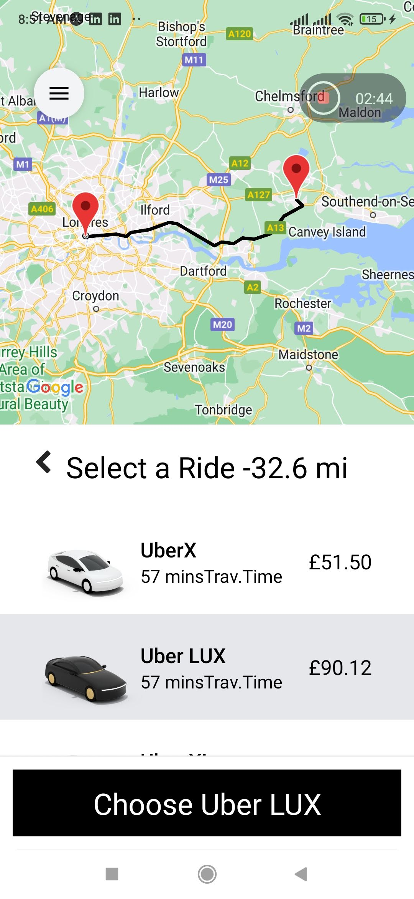

# react-native-uber-clone-y
I started with expo building
ii created this app using redux, tailwind useEffect 
use navigation from react native
use navigation API from google places navigate
on IOS and Android...

DEMO UBER-CLONE-APP

Screenshot

